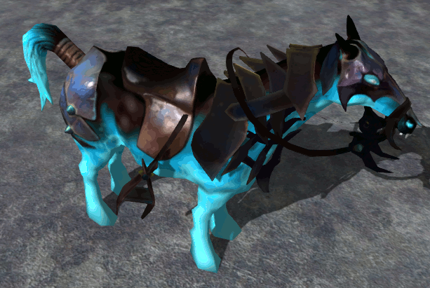

# Материалы (WIP)

Графическая подсистема является, вероятно, самой сложной и запутанной частью движка. И вместе с тем это именно та часть, в которой нужно очень хорошо ориентироваться. Вы можете легко обрабатывать ввод, воспроизводить звуки и даже не задумываться о том, как оно там внутри устроено. Но редкая игра обойдется без собственных красивых эффектов и тут без определенного набора знаний не обойтись. В одной статье невозможно охватить весь объем информации по данной теме, но я надеюсь, что смогу предоставить вам базу, опираясь на которую вы гораздо легче освоите все нюансы и тонкости рендера Urho3D.

В папке [demo](demo) находится финальный результат. Двигая мышкой можно вращать модель, колесико поворачивает источника света. Все добавленные ресурсы отделены от файлов движка и находятся в папке [demo/MyData](demo/MyData).

## Используемая версия движка

Батники для скачивания и компиляции движка находятся в папке [engine](engine).

## Импортирование модели

Для экспериментов я решил взять модель Абаддона из игры Dota 2. Здесь есть как текстурные карты, которые Urho3D поддерживает "из коробки", так и специфичные для движка Source 2. Их мы тоже не оставим без внимания. Какая карта за что отвечает можно посмотреть в [этом документе](http://media.steampowered.com/apps/dota2/workshop/Dota2ShaderMaskGuide.pdf). Но прежде чем разбираться с материалами, нам нужно преобразовать модель в понятый для Urho3D формат. Сделать это можно разными способами.

В комплекте с движком поставляется утилита `AssetImporter`, которая позволяет импортировать модели из множества форматов. Ее можно найти в папке `bin/tool`. Команда `AssetImporter.exe model abaddon_econ.fbx abaddon.mdl -t` объединяет все фрагменты модели в единое целое (в fbx-файле модель разбита на части). Обязательно включайте опцию `-t`, если собираетесь использовать карты нормалей (этот параметр добавляет к вершинам модели информацию о касательных). Команда `AssetImporter.exe node abaddon_econ.fbx abaddon.xml -t` сохранит модель в виде префаба, в котором части модели организованы в виде иерархии нод. Так как в данном fbx-файле для модели не назначены текстуры, то материалы придется создавать вручную.

Можно импортировать модель прямо из редактора (`File` > `Import model...`). В этом случае используется все та же утилита `AssetImporter`. Параметр `-t` включен по умолчанию. Остальные параметры можно указать в окне `View` > `Editor settings`.

Для любителей Блендера есть отдельный экспортер. И он гораздо более функционален, чем `AssetImporter`. Процесс установки аддона и экспорта модели с помощью Блендера смотрите на видео: <https://youtu.be/96nH6fCbGHk>. В видеозаписи используется [эта](https://github.com/urho3d-tools/blender-exporter/tree/54467a488395d86282ce18e77626a34f61ceb391) версия аддона.

